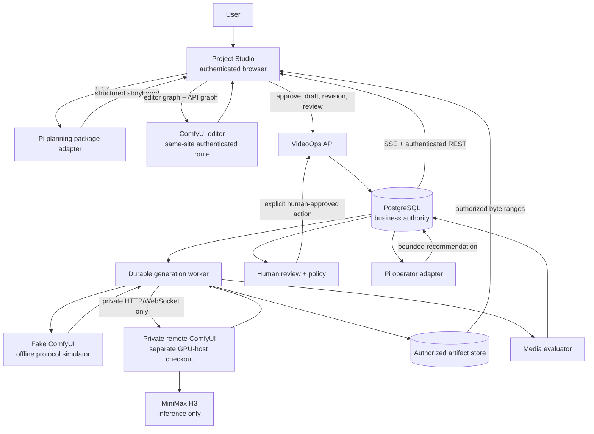

# H3 VideoOps architecture

This document describes the Phase 6 offline-fake release. The remote ComfyUI
and real H3 deployment path is a separate Phase 8 activity.

## Ownership

| Boundary | Responsibility | Deliberate exclusion |
|---|---|---|
| Project Studio | Authenticated entry point, project creation, planning/approval, selected-shot workspace, fake managed panel, review and trace display | No private ComfyUI credential, filesystem path, or direct `POST /prompt` |
| Pi package adapters | Planning and event-triggered operational recommendations using typed VideoOps callbacks | No database pool, shell, filesystem, ComfyUI client, raw prompt, or automatic remediation |
| VideoOps API and worker | Durable projects, shots, immutable workflow revisions, validation, budget, queue leases, retries, reconciliation, artifacts, evaluation, SSE, review policy | No model inference or visual-editor ownership |
| ComfyUI | Complete visual editor, graph-to-API export, execution queue, node execution, temporary host output | No VideoOps project state, acceptance decision, or retry policy |
| MiniMax H3 | Native inference nodes and model execution when deployed | No monitoring, queue durability, artifact authorization, or human approval |

## Trust and network topology

The browser has two allowed surfaces: the public authenticated VideoOps API and
the authenticated browser-facing ComfyUI editor route. A reverse proxy may
serve the editor from `/comfy/`, but it denies browser execution mutations such
as `POST /prompt`, queue mutation, and interrupt. The worker uses a separate
private route to reach the full ComfyUI protocol. The bearer token for that
route is worker-only and is never put in an iframe URL, bridge message,
telemetry, or browser response.

The bridge validates exact `parentOrigin`, source window, nonce, schema version,
message type, graph object shape, and payload size. It sends only the editable
graph and API graph to Project Studio. Project Studio performs the authenticated
draft/revision/generation calls.

## Durable data path

1. Project Studio sends a brief with an idempotency key. The API persists the
   project and starts an `agent.plan` trace span.
2. The Pi adapter reads scoped typed data and writes a structured three-shot
   proposal. A human approves it.
3. The editor or fake panel provides both graph forms. VideoOps stores a
   mutable draft, then an immutable revision with a canonical execution hash
   and validation result.
4. `Generate managed` queues the exact validated revision. PostgreSQL owns the
   attempt, lease, retry lineage, and status; the worker claims it and
   revalidates executor capability.
5. The worker submits privately, observes WebSocket events, reconciles history,
   downloads the attempt-scoped output, stores an authorized artifact, and
   runs deterministic media evaluation.
6. REST and SSE reconstruct state for Project Studio. Human accept/reject is
   persisted. Retry creates a new derived attempt. An optional Pi operator
   recommendation is bounded and requires a human-approved API action.

Trace context is carried through request headers, persisted domain events,
worker/outbox boundaries, Comfy observation, artifact/evaluation, SSE/REST
responses, review, and operator actions. Metrics use allowlisted bounded labels;
project, shot, attempt, prompt, graph, revision, artifact, and trace IDs never
become metric labels. Telemetry exporter failure is isolated from business
transactions.

## Evidence boundary

The current screenshots, fake service, and dashboard are **Offline fake**
evidence. The pinned backend/frontend compatibility manifest describes the
future **Live Comfy contract** check; it is not a claim that this environment
ran that service. A **Real H3 smoke** claim requires a separately recorded GPU
run with exact model and runtime pins. None occurred for this release.
