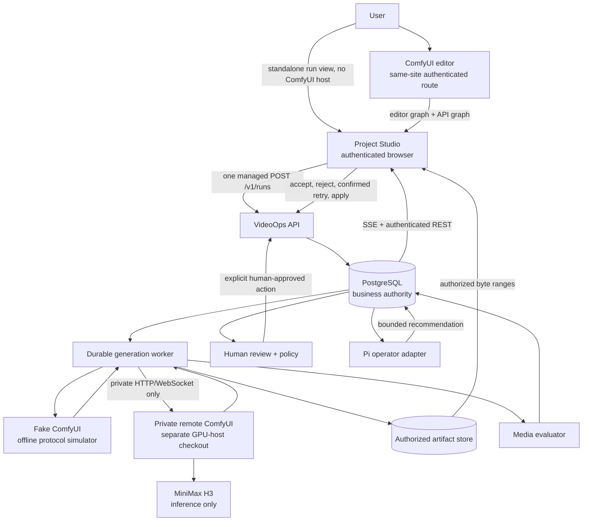

# H3 VideoOps architecture

This document describes the shipped system: a ComfyUI-first durable control
plane. Two real generations have run through it end to end, on rented GPU hosts,
on 2026-09-13. Phase 8, which closes the remote deployment path, is not
complete. `STATUS.md` carries the current evidence level.

## Ownership

| Boundary | Responsibility | Deliberate exclusion |
|---|---|---|
| Project Studio | Authenticated embedded panel and standalone run view, managed submission, run history, artifact playback, review, findings, and trace display | No private ComfyUI credential, filesystem path, or direct `POST /prompt` |
| Pi package adapters | Event-triggered operational recommendations and windowed session digests, using typed VideoOps callbacks | No database pool, shell, filesystem, ComfyUI client, raw prompt, or automatic remediation |
| VideoOps API and worker | Durable projects, shots, immutable workflow revisions, validation, budget, queue leases, retries, reconciliation, artifacts, evaluation, SSE, review policy | No model inference or visual-editor ownership |
| ComfyUI | Complete visual editor, graph-to-API export, execution queue, node execution, temporary host output | No VideoOps project state, acceptance decision, or retry policy |
| MiniMax H3 | Native inference nodes and model execution when deployed | No monitoring, queue durability, artifact authorization, or human approval |

## Trust and network topology

The browser has two allowed surfaces: the public authenticated VideoOps API and
the authenticated browser-facing ComfyUI editor route. A reverse proxy may
serve the editor from `/comfy/`, but it denies browser execution mutations such
as `POST /prompt`, queue mutation, and interrupt. The worker uses a separate
private route to reach the full ComfyUI protocol. The bearer token for that
route is worker-only and is never put in an iframe URL, bridge message,
telemetry, or browser response.

The bridge validates exact `parentOrigin`, source window, nonce, schema version,
message type, graph object shape, and payload size. It sends only the editable
graph and API graph to Project Studio. Project Studio performs the authenticated
draft/revision/generation calls.

## Durable data path

1. The editor provides both graph forms over the bridge. `Managed Run` sends
   them to Project Studio, which submits one `POST /v1/runs` with an
   idempotency key. There is no planning chain to walk first.
2. The API persists the project's implicit shot on first submission, stores an
   immutable revision with a canonical execution hash and validation result,
   and pins it to the executor capability fingerprint observed at submit time.
3. The validated revision is queued. PostgreSQL owns the attempt, lease, retry
   lineage, and status; the worker claims it and revalidates executor
   capability.
4. The worker submits privately, observes WebSocket events, reconciles history,
   downloads the attempt-scoped output, stores an authorized artifact, and
   runs deterministic media evaluation.
5. REST and SSE reconstruct state for Project Studio. Human accept/reject is
   persisted. Retry creates a new derived attempt. An optional Pi operator
   recommendation is bounded and requires a human-approved API action; a
   session digest summarises a window of the same read-only tools.

Trace context is carried through request headers, persisted domain events,
worker/outbox boundaries, Comfy observation, artifact/evaluation, SSE/REST
responses, review, and operator actions. Metrics use allowlisted bounded labels;
project, shot, attempt, prompt, graph, revision, artifact, and trace IDs never
become metric labels. Telemetry exporter failure is isolated from business
transactions.

## Evidence boundary

Every screenshot published here, the fake service, and the dashboard are
**Offline fake** evidence. The **Live Comfy contract** check passed on
2026-09-13 against a pinned remote executor, and one **Real H3 smoke** ran
through the managed path on the same rented RTX 5090: an accepted attempt at
the profile defaults, with exact model and runtime pins recorded in
`EVIDENCE-MANIFEST.md`. That host no longer exists and nothing here provisions
one, so neither is reproducible from this repository, and the Phase 8 gate —
which requires every row, including browser-bridge checks that have not been
performed — stays open.
