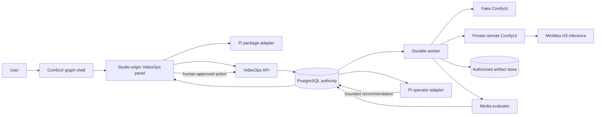

# H3 VideoOps

H3 VideoOps is a durable video-operations control plane for ComfyUI. You build a
graph in ComfyUI; VideoOps runs it on a GPU host you control, and keeps an
auditable record of exactly what ran.

ComfyUI is the visual entry point and graph shell. The VideoOps panel mounts
inside it as an exact-origin Studio iframe, and the bearer token stays in the
Studio origin. VideoOps owns workflow revisions, queue policy, retries,
artifacts, evaluation, and human review. Pi supplies bounded operational
recommendations. MiniMax H3 owns inference only.


## What it does

- **One-call submission.** A loaded graph goes through a single managed
  `POST /v1/runs`. There is no planning chain to walk first.
- **Immutable revisions.** Every submission is hashed server-side and pinned to
  the executor capability fingerprint observed at submit time, so "which nodes
  and which model actually existed" is recorded rather than reconstructed.
- **Durable execution.** PostgreSQL is the authority. Queue leases are
  reclaimable after worker loss; duplicate executor events and uncertain
  submissions are reconciled before a human-confirmed derived retry.
- **Deterministic evaluation.** Every artifact passes media checks before it can
  be accepted.
- **An append-only timeline.** Domain events reconstruct what happened over REST
  or SSE, with trace context carried across worker, outbox, executor
  observation, and stream boundaries.

## Status

The durable control plane, the ComfyUI-first shell, and the offline execution
loop are implemented and tested. The run view is at
`assets/screenshots/01-run-history.png` and the rest of the captured set.

**One real MiniMax H3 clip has been generated, through the managed run path.**
On 2026-09-13 a pinned remote executor on a rented RTX 5090 accepted the graph
this repository ships: submitted through a single `POST /v1/runs` against a
budgeted project, driven by the durable worker, evaluated, and stored as an
accepted attempt — h264 960x544, 124 frames, 24 fps, 5.17 s, AAC 32 kHz stereo,
which is the pinned profile default exactly. That host no longer exists and
nothing here provisions a GPU on demand, so it is a record of one run, not
something a clone of this repository reproduces.

**Phase 8 is not complete.** Its gate is every row of the step 2 table, and the
browser-bridge row — whether a real ComfyUI's pip-served pinned frontend behaves
like the build the browser suite exercises — has not been performed.

Every capture published here is `Offline fake` — produced by the deterministic
fake executor, not by a GPU. They demonstrate orchestration, revisions, retries,
evaluation, review, and browser flow. They are not H3 inference evidence, and
fake output is not a quality or throughput benchmark.

The current evidence level, the verification record, and what remains open are
in [`STATUS.md`](STATUS.md). Capture commands, provenance, and secret review for
every image — and the full record of that one real run — are in
[`EVIDENCE-MANIFEST.md`](EVIDENCE-MANIFEST.md).

## Quick start

Requirements: Node.js 24 LTS, Corepack with pnpm 9.15.0, a Compose-compatible
runtime, and `ffmpeg`/`ffprobe`.

```sh
nvm install 24
nvm use 24
corepack enable
corepack prepare pnpm@9.15.0 --activate
cp .env.example .env
pnpm install --frozen-lockfile
pnpm prerequisites
pnpm dev
```

The development launcher audits prerequisites, creates the synthetic media
fixture, starts PostgreSQL, applies migrations, builds the workspace, and starts
the API, worker, fake ComfyUI service, and Project Studio. No cloud account,
paid provider, hosted LLM key, model download, or GPU is needed.

Project Studio is at `http://127.0.0.1:5173` and supplies the embedded panel.
The fake ComfyUI graph shell is at `http://127.0.0.1:8188`; open it first for
the ComfyUI-first flow. API readiness is at
`http://127.0.0.1:3000/health/ready`; fake ComfyUI readiness is at
`http://127.0.0.1:8188/health`. Enter the local development token from `.env` in
the Studio panel when it opens inside ComfyUI. Every `/v1/*` request is
authenticated and every repeatable mutation requires an `Idempotency-Key`.

### Five-minute demo

With the local stack running, seed the deterministic project and follow
[`DEMO-SCRIPT.md`](DEMO-SCRIPT.md):

```sh
pnpm demo:seed
```

The seed creates only the named `[Demo] Product story control room` draft; it
does not pre-complete revisions, attempts, or review. It is idempotent. To
remove only that named demo project and its artifact objects:

```sh
pnpm demo:reset -- --force
```

The reset prints its exact local database, development tenant, and artifact root
before mutation, requires `--force`, rejects unsafe paths, and preserves
unrelated projects and artifacts. It never touches model directories or a remote
ComfyUI output directory.

## Executor modes

`COMFY_MODE=fake` is the default. The fake service implements the HTTP/WebSocket
protocol the worker needs and emits deterministic media from a tracked fixture,
so the entire loop runs on a workstation with no GPU and no spend. It is also
what makes the recovery paths testable: a real GPU cannot be asked to drop a
WebSocket, emit a duplicate event, or return an uncertain submission on demand.

`COMFY_MODE=remote` expects a separately deployed, private ComfyUI service and
exact URL configuration. The GPU deployment is a complete, separate ComfyUI
checkout — it is not vendored here, and its model directory is never a client
resource. See [`infra/gpu-executor`](infra/gpu-executor) for the host runbook.

## Architecture



| Component | Owns | Does not own |
|---|---|---|
| Project Studio | Authenticated embedded panel, run history, revision loading, pin/review, findings, trace display, and standalone fallback routes | Private executor credentials or direct executor submission |
| VideoOps API/worker | PostgreSQL state, immutable revisions, validation, budgets, leases, retries, reconciliation, artifacts, evaluation, SSE, review, operator policy | Model inference |
| ComfyUI | Visual graph editor, public graph-to-API export, plugin surfaces, and host-side executor shell | VideoOps bearer token, project policy, durable review, billing, or VideoOps authorization |
| Pi packages | Bounded operational recommendations | Direct database, shell, filesystem, ComfyUI, token, or automatic remediation access |
| MiniMax H3 | Inference when actually deployed on a compatible GPU host | Monitoring, queue durability, retries, artifacts, or human approval |

VideoOps consumes the published `@earendil-works/pi-agent-core` and
`@earendil-works/pi-ai` packages, not the whole Pi repository. The H3 model is an
inference dependency, not a monitoring service.

### Trust and route boundaries

The browser opens the ComfyUI graph shell and the plugin mounts a Studio-origin
iframe. Only the Studio iframe calls the public VideoOps API, using the token in
its own origin. Only the VideoOps worker can call the private ComfyUI
`POST /prompt` route. The browser never receives `COMFY_BASE_URL`,
`COMFY_WS_URL`, `COMFY_AUTH_TOKEN`, private hostnames, signed output paths, or a
ComfyUI bearer token. The bridge uses an exact parent origin, nonce, source
window, schema, and payload-size check; ComfyUI exports the editable graph and
API graph without calling VideoOps itself.

The token isolation test records no credential in ComfyUI storage or globals,
and confirms that the Studio iframe remains cross-origin.

### Artifact handling

Artifacts are stored outside public static paths with tenant/project/attempt
scope checks. Project Studio requests an authorized artifact resource and the
API supports bounded byte-range responses for playback. Clients submit opaque
resource IDs, never filesystem paths or object keys.

## Verification

```sh
pnpm check                           # format, lint, strict TypeScript, unit tests, build
pnpm test:integration                # PostgreSQL-backed
pnpm test:e2e                        # browser suite against the fake executor
pnpm test:comfy-live                 # SKIP when no remote executor is configured
pnpm observability:config
pnpm security:scan
pnpm docs:check
pnpm release:verify
```

`COMFY_LIVE_TEST=1 COMFY_MODE=remote pnpm test:comfy-live` is an opt-in contract
check and reports **SKIP**, not pass, without the separately deployed pinned
service.

The pinned ComfyUI frontend is not vendored and never builds in CI. To run the
tagged `@comfy-frontend` specs against it:

```sh
pnpm comfy:frontend
pnpm test:e2e e2e/comfy-frontend.spec.ts
```

Without `.data/comfy-frontend/dist`, the fake shell returns an actionable 503 on
`/` and the tagged specs skip with that remediation. The untagged suite is
unaffected.

## Observability

The named observability services are pinned and optional for normal tests:

```sh
pnpm observability:up
# open http://127.0.0.1:3001 and select the H3 VideoOps dashboard
pnpm observability:down
```

`observability:down` stops only OpenTelemetry Collector, Tempo, Prometheus, and
Grafana. It does not remove PostgreSQL, its volume, or the artifact directory.
The API exposes Prometheus text at `http://127.0.0.1:3000/metrics`. Copy the
`x-trace-id` response header or the trace shown in a Project Studio error
notice, then search that value in Tempo. The same trace is continued by worker
spans, executor observation, artifact/evaluation, SSE/REST reconstruction,
review, and the optional operator action where that path is exercised.

Exporter failure is diagnostic only and cannot roll back or block business
state.

## Repository map

- `apps/web` — React/Vite Project Studio
- `apps/api` — Fastify API, durable worker, Pi operator adapter
- `apps/fake-comfy` — deterministic ComfyUI HTTP/WebSocket simulator
- `packages/db` — PostgreSQL schema, migrations, repositories, leases
- `packages/workflow-compiler` — H3 profile, canonical hashing, validation
- `packages/comfy-client` — fake and authenticated HTTP/WebSocket contracts
- `packages/evaluator` — deterministic media checks
- `packages/telemetry` — trace context, redaction, bounded metrics, exporter
- `integrations/comfyui-videoops` — frontend-only ComfyUI bridge
- `infra/gpu-executor` — separate GPU-host runbook; no weights are stored here
- `infra/observability` — pinned local telemetry stack and dashboard

Exact ComfyUI, frontend, workflow-template, H3 source, model filename, and Pi
package pins are recorded in [`DEPENDENCIES.md`](DEPENDENCIES.md),
[`infra/gpu-executor/pin-manifest.json`](infra/gpu-executor/pin-manifest.json),
and
[`workflows/minimax-h3/compatibility-manifest.json`](workflows/minimax-h3/compatibility-manifest.json).

## Security and limitations

The system implements authentication, idempotency, tenant/project scope checks,
private executor route separation, exact iframe bridge origins and nonces,
payload-free telemetry, bounded metric labels, redacted problem details,
authorized range delivery, and human confirmation for budget-spending retries or
operator actions. These are implementation boundaries, not a security
certification or a public-production readiness claim.

Known limitations are intentionally explicit:

- Real inference is not repeatable from here. Remote ComfyUI compatibility and
  one real H3 clip were exercised once, on a rented host that no longer exists;
  nothing in this repository provisions a GPU on demand.
- No H3 weights are bundled.
- Production billing, autoscaling, multitenancy, SLOs, and Kubernetes are not
  implemented.
- The pinned frontend exposes no supported queue-command override, so native
  queue controls are disabled and the public `Managed Run` action is used. No
  frontend internals are patched.
- The pinned frontend's topbar badge metadata is static, so live readiness,
  count, and budget values are shown in the Studio and bottom-panel status
  surfaces instead.

Dependency attribution, license status, and migration notes are in
[`DEPENDENCIES.md`](DEPENDENCIES.md) and [`CHANGELOG.md`](CHANGELOG.md). No
project license has been selected yet, so this repository being readable grants
no use, modification, or redistribution rights.
