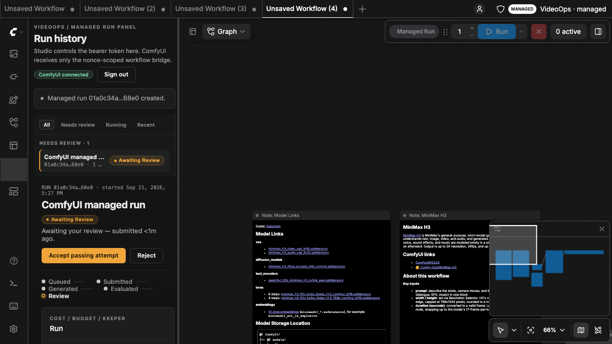
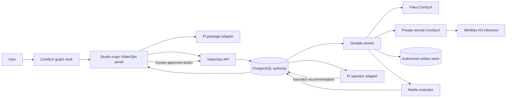

# H3 VideoOps

H3 VideoOps is a durable video-operations control plane for ComfyUI. You build a
graph in ComfyUI; VideoOps runs it on a GPU host you control, and keeps an
auditable record of exactly what ran.

ComfyUI is the visual entry point and graph shell. The VideoOps panel mounts
inside it as an exact-origin Studio iframe, and the bearer token stays in the
Studio origin. VideoOps owns workflow revisions, queue policy, retries,
artifacts, evaluation, and human review. Pi supplies bounded operational
recommendations. MiniMax H3 owns inference only.



## Quick start

Common setup once, then one of three tracks. Every track ends with the same
system running; only the executor differs.

### Common — the libraries, then the code

```sh
# macOS
brew install ffmpeg
brew install --cask docker            # then launch Docker Desktop once
curl -o- https://raw.githubusercontent.com/nvm-sh/nvm/v0.40.1/install.sh | bash
nvm install 24 && nvm use 24
```

```sh
# Ubuntu / Debian
sudo apt-get update && sudo apt-get install -y ffmpeg docker.io docker-compose-v2
curl -fsSL https://deb.nodesource.com/setup_24.x | sudo -E bash -
sudo apt-get install -y nodejs
```

ffmpeg is not optional: the evaluator shells out to `ffprobe` and `ffmpeg`, and
without them no attempt can pass evaluation. Docker is needed only by tracks A
and B, which run PostgreSQL in a container.

```sh
git clone https://github.com/goAustin/AutoCamera.git
cd AutoCamera
```

Track C needs neither step — its script installs the libraries and clones this
repository itself, on the rented host.

### Where things are

Three addresses, the same in every track. They are always on **loopback** — the
system never publishes a port — so on a rented host you reach them through the
SSH tunnel in track C, which maps the ports identically so these URLs do not
change.

| | Address | What you do there |
|---|---|---|
| **ComfyUI** | <http://127.0.0.1:8188> | Load the H3 graph and press **Managed Run**. This is where you generate video. `COMFY_PORT` moves it when 8188 is taken |
| **Project Studio** | <http://127.0.0.1:5173> | Run history, play the clip, accept or reject. Sign in with the token in `DEV_AUTH_TOKEN` — `dev-token` by default |
| **VideoOps API** | <http://127.0.0.1:3000> | `/health/ready`, `/v1/executor`, and the managed `POST /v1/runs` |

In track A that ComfyUI port is the bundled simulator's shell, which serves the
real pinned editor only after `pnpm comfy:frontend` and answers `503` until then.
In tracks B and C it is the real ComfyUI.

You can generate from either end: **Managed Run** in ComfyUI, or `pnpm demo:run`
against the API. Both take the same managed path and both land in Project Studio
for review — the browser is a convenience, not a requirement, which is what makes
a headless rented host workable.

### Track A — this machine, no GPU

```sh
bash scripts/setup/local.sh
```

Installs dependencies and starts everything: PostgreSQL, migrations, the API and
worker, the bundled ComfyUI simulator, and Project Studio. Leave it running; it
takes about ten seconds.

Open **<http://127.0.0.1:5173>**, paste the token `dev-token`, and click **Enter
Project Studio**. You land on **Run history**. Then generate a clip:

```sh
pnpm demo:seed       # creates the "[Demo] Product story control room" project
pnpm demo:run        # submits the shipped graph, waits for the attempt
```

The run appears in **Run history**: the worker claims it, the simulator returns
the fixture clip, the artifact is stored and evaluated, and the attempt lands on
**Awaiting Review** with evaluation **Passed**. Select it, play the clip, then
click **Accept passing attempt**. That is the whole loop — submission, queue,
execution, artifact, evaluation, human review — with no GPU and no spend.

To drive it from ComfyUI instead, build the pinned editor once with
`pnpm comfy:frontend` (without it `:8188` answers `503`), then open
**<http://127.0.0.1:8188>** and use **Managed Run**.

### Track B — your own Linux GPU box

```sh
bash scripts/setup/gpu-local.sh
```

Needs a CUDA 13-capable driver, **at least 32 GB of VRAM** (the verified run
peaked at 31.9 GB of an RTX 5090's 32.6), **64 GB or more of host RAM** —
ComfyUI offloads the 32B text encoder there between nodes — and ~120 GB of disk.

The script installs the pinned ComfyUI outside this repository, downloads and
checksums ~44 GB of weights, installs the frontend bridge, points `.env` at the
executor on loopback, and starts the stack. The first run is dominated by the
download; a re-run skips every file it already verified.

```sh
curl http://127.0.0.1:3000/v1/executor -H "authorization: Bearer dev-token"
COMFY_LIVE_TEST=1 COMFY_MODE=remote pnpm test:comfy-live
```

Then use it exactly as in track A — ComfyUI at <http://127.0.0.1:8188>, Project
Studio at <http://127.0.0.1:5173>. The executor is the only thing that changed.

### Track C — a rented GPU host

#### What to rent

Any provider works; these are the constraints, not a vendor list.

| | Ask for | Why |
|---|---|---|
| GPU | **NVIDIA Blackwell, 32 GB VRAM or more** | The pinned text encoder is NVFP4, a Blackwell data type. Hopper and Ada have no native path and must dequantize — a 32B encoder at bf16 is ~64 GB for the encoder alone, so an 80 GB H100 can fail where a 32 GB Blackwell card succeeds |
| Host RAM | **64 GB minimum, 128 GB preferred** | ComfyUI offloads the idle encoder to host RAM between nodes. Too little looks exactly like a GPU failure |
| Disk | **120 GB** | ~44 GB of weights plus the image and working space. Disk is usually billed too, so do not over-provision |
| Driver | **CUDA 13 capable** | Verified against `torch 2.14.0+cu130` |
| Network | **Fast down-link** | 44 GB of weights on every fresh rental; this is most of your setup time |
| Billing | **On-demand, persistent** | Not spot or interruptible, and not per-second serverless |
| Image | **A plain CUDA/PyTorch image** | Not a ComfyUI template — see below |

**Do not start from a prebuilt ComfyUI image.** This project installs its own
ComfyUI at a pinned commit, and a template's copy fights it twice: the template
already serves ComfyUI on port 8188 behind a proxy, so the pinned executor cannot
bind, and the image's preinstalled torch is the one the executor ends up using.
The verified run is against `torch 2.14.0+cu130`; an image that ships something
else silently gives you something else. A plain CUDA/PyTorch image avoids both.

An **RTX 5090** is the verified rung and the cheapest that works. On 2026-09-13 one
ran the full pinned profile — 960x544, 124 frames, 20 steps — in 89 seconds, peaking
at 31.9 GB of its 32.6. Do not climb higher without an actual out-of-memory failure
to justify it.

Two choices that lose a whole session rather than slowing one down. **Never take an
interruptible or spot instance**: the worker holds a live WebSocket and reconciles
against `/history`, so a preempted host loses the generation and its evidence.
**Never use a per-second serverless GPU product**: the executor is a persistent
process, not a cold-started function.

That whole verified session — provisioning, 44 GB of weights, the generation, and
teardown — cost **$1.32 over 1.6 GPU-hours**. Most of it was installing, not
generating.

#### Then, one command

A fresh host has nothing on it — no checkout, and no copy of this script. So the
first thing you run is the one that fetches it:

```sh
curl -fsSL https://raw.githubusercontent.com/goAustin/AutoCamera/main/scripts/setup/gpu-rented.sh -o setup.sh
bash setup.sh
```

Run that over SSH once the host is up, or hand it to your provider's run-at-boot
hook and the host builds itself while you are still connecting. The script clones
this repository itself, which is why there is nothing to copy up first.

Download it rather than piping `curl` straight into `bash`. A piped script is read
from the same standard input that the commands inside it inherit, and this one
installs packages and runs `su`; if one of those consumes stdin it eats the rest of
the script.

If the host already has a checkout — a second run, or you cloned it by hand — the
same script is in the tree and does the same work:

```sh
bash scripts/setup/gpu-rented.sh
```

If port 8188 is already taken — which is what a ComfyUI template image does — the
script stops and names the process holding it. Pick another port and everything
that has to agree moves together:

```sh
COMFY_PORT=8288 bash setup.sh
```

That sets the executor's port and the three `COMFY_*` values in `.env` at once.
Re-running is cheap: verified weights are never downloaded twice, and an existing
checkout is fast-forwarded so it picks up fixes.

Topology A: the whole VideoOps stack runs on the rented host with ComfyUI bound
to loopback, so no generated byte crosses a network. The script installs the
libraries, PostgreSQL, the executor and the weights, builds, migrates, starts the
API, and stops — having submitted and destroyed nothing.

Then generate:

```sh
pnpm demo:seed       # a project with a real budget, so spending is governed
pnpm demo:run        # submits the shipped graph, waits for the attempt
```

Nothing stops the rental meter but you. Your provider's budget controls are
separate from this system's: a project's `budgetUsd` governs recorded attempt
spend, not GPU wall-clock. Set an alarm, and **destroy** the instance when you are
done — on most providers, merely stopping one keeps billing for its disk.

Because the host is disposable, treat its PostgreSQL data and `ARTIFACT_ROOT` as
evidence to export before teardown rather than as storage.

Project Studio is a second process there, reached over an SSH tunnel:

```sh
# on the host, alongside the API
VITE_API_ORIGIN=http://127.0.0.1:3000 pnpm --filter @h3/web dev

# from your own machine
ssh -N -p <port> root@<host> \
  -L 5173:127.0.0.1:5173 -L 3000:127.0.0.1:3000 -L 8188:127.0.0.1:8188
```

If you moved the executor with `COMFY_PORT`, forward that port on both sides of
the `-L` instead — the ComfyUI address below changes with it.

With that tunnel open, the addresses above work unchanged in the browser on your
own machine: ComfyUI at <http://127.0.0.1:8188>, Project Studio at
<http://127.0.0.1:5173>. Nothing is published from the rented host.

Map the ports identically. The API's CORS allowlist (`WEB_ORIGIN`), the bridge's
exact `parentOrigin` check, and — where a gateway fronts ComfyUI — its
`frame-ancestors` header all pin one exact origin. A tunnel that preserves
`127.0.0.1:5173` satisfies every one of them with no configuration change, on
this rental and the next. A published port or a provider hostname breaks all
three at once.

[`infra/gpu-executor/README.md`](infra/gpu-executor/README.md) is the full host
runbook, and every step the script performs written out by hand: the other
topologies, the browser gateway that denies `POST /prompt` and queue mutation,
keeping models on a volume that outlives the host, the cost breaker, teardown.

### Stopping and resetting

```sh
# Ctrl-C the setup terminal, then:
pnpm infra:down                 # stop PostgreSQL
pnpm demo:reset -- --force      # remove only the demo project and its artifacts
```

### Choose an executor

The control plane is identical in all three; only the executor changes.

| `COMFY_MODE` | Executor | GPU | Track |
|---|---|---|---|
| `fake` (default) | bundled simulator | none | A |
| `remote` | ComfyUI on your own machine | yours | B |
| `remote` | ComfyUI on a rented host | rented | C |

`remote` means *a real ComfyUI*, not *a remote machine* — your own GPU uses it
too, pointed at `127.0.0.1`. And `fake` is not a lesser mode: it is the only way
to test the recovery paths, because a real GPU cannot be asked to drop a
WebSocket, emit a duplicate event, or return an uncertain submission on demand.

### Why track C is not just track B

`pnpm dev` starts PostgreSQL through `docker compose`, and a container runtime is
a blocking prerequisite, so on a rented image that has none it stops before
starting anything. Track C's script does that work directly instead — this is
what it runs, if you would rather follow along by hand:

```sh
apt-get install -y postgresql ffmpeg
pg_ctlcluster "$(ls /etc/postgresql | head -1)" main start
set -a; . ./.env; set +a     # nothing here reads .env on its own
pnpm build                   # tsc -b first, or db:migrate cannot resolve @h3/domain
pnpm db:migrate
node apps/api/dist/main.js   # the API alone: pnpm dev also starts Project Studio
```

### A longer walkthrough

[`DEMO-SCRIPT.md`](DEMO-SCRIPT.md) is a talk track over the same stack: the
retryable-failure and derived-retry paths, the operator findings and their
confirmations, the cost and digest routes, and following one trace through
Tempo.

## What it does

- **One-call submission.** A loaded graph goes through a single managed
  `POST /v1/runs`. There is no planning chain to walk first.
- **Immutable revisions.** Every submission is hashed server-side and pinned to
  the executor capability fingerprint observed at submit time, so "which nodes
  and which model actually existed" is recorded rather than reconstructed.
- **Durable execution.** PostgreSQL is the authority. Queue leases are
  reclaimable after worker loss; duplicate executor events and uncertain
  submissions are reconciled before a human-confirmed derived retry.
- **Deterministic evaluation.** Every artifact passes media checks before it can
  be accepted.
- **An append-only timeline.** Domain events reconstruct what happened over REST
  or SSE, with trace context carried across worker, outbox, executor
  observation, and stream boundaries.

## Status

The durable control plane, the ComfyUI-first shell, and the offline execution
loop are implemented and tested. The run view is at
`assets/screenshots/01-run-history.png` and the rest of the captured set.

**Two real MiniMax H3 clips have been generated, through the managed run path,
on different hardware.** On 2026-09-13 a pinned remote executor on a rented RTX
5090 accepted the graph this repository ships: submitted through a single
`POST /v1/runs` against a budgeted project, driven by the durable worker,
evaluated, and stored as an accepted attempt — h264 960x544, 124 frames, 24 fps,
5.17 s, AAC 32 kHz stereo, the pinned profile default exactly.

On 2026-09-15 the same profile was produced again on a rented RTX PRO 5000
Blackwell, provisioned end to end by `scripts/setup/gpu-rented.sh` from a clean
clone with no manual install steps, and reaching `awaiting_review` with
evaluation passed. The capability fingerprint and workflow hash matched the first
run exactly, on a different card and a different PyTorch build. So the profile is
reproducible from a clone — but you still have to rent the host yourself, and no
weights are bundled.

**Phase 8 is not complete.** Its gate is every row of the step 2 table, and the
browser-bridge row has not been performed. Real ComfyUI logs the frontend bridge
as `IMPORT FAILED` — it registers no execution nodes by design — and whether the
extension's web directory is still served after that was never checked in a
browser. Generation is unaffected: both real runs were submitted through the API.

Every capture published here is `Offline fake` — produced by the deterministic
fake executor, not by a GPU. They demonstrate orchestration, revisions, retries,
evaluation, review, and browser flow. They are not H3 inference evidence, and
fake output is not a quality or throughput benchmark.

The current evidence level, the verification record, and what remains open are
in [`STATUS.md`](STATUS.md). Capture commands, provenance, and secret review for
every image — and the full record of both real runs — are in
[`EVIDENCE-MANIFEST.md`](EVIDENCE-MANIFEST.md).

## Architecture



| Component | Owns | Does not own |
|---|---|---|
| Project Studio | Authenticated embedded panel, run history, revision loading, pin/review, findings, trace display, and standalone fallback routes | Private executor credentials or direct executor submission |
| VideoOps API/worker | PostgreSQL state, immutable revisions, validation, budgets, leases, retries, reconciliation, artifacts, evaluation, SSE, review, operator policy | Model inference |
| ComfyUI | Visual graph editor, public graph-to-API export, plugin surfaces, and host-side executor shell | VideoOps bearer token, project policy, durable review, billing, or VideoOps authorization |
| Pi packages | Bounded operational recommendations | Direct database, shell, filesystem, ComfyUI, token, or automatic remediation access |
| MiniMax H3 | Inference when actually deployed on a compatible GPU host | Monitoring, queue durability, retries, artifacts, or human approval |

VideoOps consumes the published `@earendil-works/pi-agent-core` and
`@earendil-works/pi-ai` packages, not the whole Pi repository. The H3 model is an
inference dependency, not a monitoring service.

### Trust and route boundaries

The browser opens the ComfyUI graph shell and the plugin mounts a Studio-origin
iframe. Only the Studio iframe calls the public VideoOps API, using the token in
its own origin. Only the VideoOps worker can call the private ComfyUI
`POST /prompt` route. The browser never receives `COMFY_BASE_URL`,
`COMFY_WS_URL`, `COMFY_AUTH_TOKEN`, private hostnames, signed output paths, or a
ComfyUI bearer token. The bridge uses an exact parent origin, nonce, source
window, schema, and payload-size check; ComfyUI exports the editable graph and
API graph without calling VideoOps itself.

The token isolation test records no credential in ComfyUI storage or globals,
and confirms that the Studio iframe remains cross-origin.

### Artifact handling

Artifacts are stored outside public static paths with tenant/project/attempt
scope checks. Project Studio requests an authorized artifact resource and the
API supports bounded byte-range responses for playback. Clients submit opaque
resource IDs, never filesystem paths or object keys.

## Verification

None of this is required to run the system — `pnpm dev` above needs none of it.
These are the gates the project holds itself to, and CI runs them on every push:

```sh
pnpm check                           # format, lint, strict TypeScript, unit tests, build
pnpm test:integration                # PostgreSQL-backed
pnpm test:e2e                        # browser suite against the fake executor
pnpm test:comfy-live                 # SKIP when no remote executor is configured
pnpm observability:config
pnpm security:scan
pnpm docs:check
pnpm release:verify
```

`COMFY_LIVE_TEST=1 COMFY_MODE=remote pnpm test:comfy-live` is an opt-in contract
check and reports **SKIP**, not pass, without the separately deployed pinned
service.

The pinned ComfyUI frontend is not vendored and never builds in CI. To run the
tagged `@comfy-frontend` specs against it:

```sh
pnpm comfy:frontend
pnpm test:e2e e2e/comfy-frontend.spec.ts
```

Without `.data/comfy-frontend/dist`, the fake shell returns an actionable 503 on
`/` and the tagged specs skip with that remediation. The untagged suite is
unaffected.

## Observability

The named observability services are pinned and optional for normal tests:

```sh
pnpm observability:up
# open http://127.0.0.1:3001 and select the H3 VideoOps dashboard
pnpm observability:down
```

`observability:down` stops only OpenTelemetry Collector, Tempo, Prometheus, and
Grafana. It does not remove PostgreSQL, its volume, or the artifact directory.
The API exposes Prometheus text at `http://127.0.0.1:3000/metrics`. Copy the
`x-trace-id` response header or the trace shown in a Project Studio error
notice, then search that value in Tempo. The same trace is continued by worker
spans, executor observation, artifact/evaluation, SSE/REST reconstruction,
review, and the optional operator action where that path is exercised.

Exporter failure is diagnostic only and cannot roll back or block business
state.

## Repository map

- `apps/web` — React/Vite Project Studio
- `apps/api` — Fastify API, durable worker, Pi operator adapter
- `apps/fake-comfy` — deterministic ComfyUI HTTP/WebSocket simulator
- `packages/db` — PostgreSQL schema, migrations, repositories, leases
- `packages/workflow-compiler` — H3 profile, canonical hashing, validation
- `packages/comfy-client` — fake and authenticated HTTP/WebSocket contracts
- `packages/evaluator` — deterministic media checks
- `packages/telemetry` — trace context, redaction, bounded metrics, exporter
- `integrations/comfyui-videoops` — frontend-only ComfyUI bridge
- `infra/gpu-executor` — separate GPU-host runbook; no weights are stored here
- `infra/observability` — pinned local telemetry stack and dashboard

Exact ComfyUI, frontend, workflow-template, H3 source, model filename, and Pi
package pins are recorded in [`DEPENDENCIES.md`](DEPENDENCIES.md),
[`infra/gpu-executor/pin-manifest.json`](infra/gpu-executor/pin-manifest.json),
and
[`workflows/minimax-h3/compatibility-manifest.json`](workflows/minimax-h3/compatibility-manifest.json).

## Security and limitations

The system implements authentication, idempotency, tenant/project scope checks,
private executor route separation, exact iframe bridge origins and nonces,
payload-free telemetry, bounded metric labels, redacted problem details,
authorized range delivery, and human confirmation for budget-spending retries or
operator actions. These are implementation boundaries, not a security
certification or a public-production readiness claim.

Known limitations are intentionally explicit:

- Real inference is not repeatable from here. Remote ComfyUI compatibility and
  one real H3 clip were exercised once, on a rented host that no longer exists;
  nothing in this repository provisions a GPU on demand.
- No H3 weights are bundled.
- Production billing, autoscaling, multitenancy, SLOs, and Kubernetes are not
  implemented.
- The pinned frontend exposes no supported queue-command override, so native
  queue controls are disabled and the public `Managed Run` action is used. No
  frontend internals are patched.
- The pinned frontend's topbar badge metadata is static, so live readiness,
  count, and budget values are shown in the Studio and bottom-panel status
  surfaces instead.

Dependency attribution, license status, and migration notes are in
[`DEPENDENCIES.md`](DEPENDENCIES.md) and [`CHANGELOG.md`](CHANGELOG.md). This
project is MIT licensed ([`LICENSE`](LICENSE)); ComfyUI, which it drives, is
GPL-3.0 and is not vendored or redistributed here.
