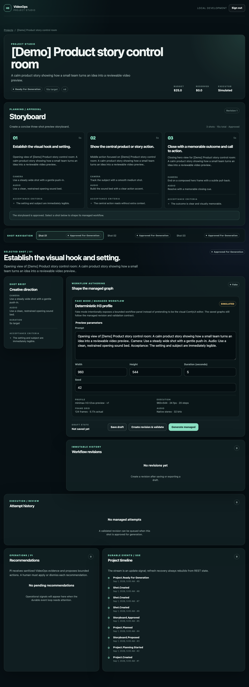
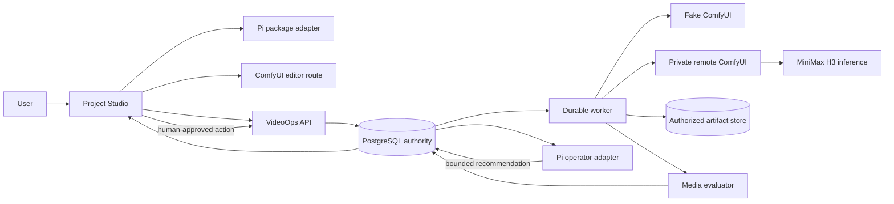

# H3 VideoOps

H3 VideoOps is a local, durable video-operations control plane. Project
Studio is the authenticated user entry point; VideoOps owns workflow
revisions, queue policy, retries, artifacts, evaluation, and human review;
ComfyUI is the visual editing and execution surface; Pi supplies bounded
planning and operational recommendations; MiniMax H3 owns inference only.

## Current release status

**Phase 6 complete — `v0.1.0-mvp`, Offline fake evidence.** The complete local
flow is deterministic, GPU-free, and reproducible: create a project, plan and
approve a three-shot storyboard, save and validate an immutable managed
revision, queue a fake clip, inspect the artifact and evaluation, and accept
or reject it with durable recovery and operator evidence.

The remote ComfyUI contract and a real MiniMax H3 GPU smoke run are explicitly
deferred to **Phase 8**. This release generated no real H3 clip. A live ComfyUI
editor/contract test and real H3 generation are separate evidence levels; the
offline screenshots and metrics must not be read as GPU or H3 evidence.



Offline evidence set: `01-project-create.png`, `02-storyboard-approved.png`,
`03-managed-workflow.png`, `04-revision-history.png`, `05-attempt-progress.png`,
`06-artifact-review.png`, `07-timeline-recommendation.png`, and
`08-completed-project.png`; the enabled local observability view is
`09-grafana-dashboard.png` (full manifest: `EVIDENCE-MANIFEST.md`).

More current evidence is listed in [`EVIDENCE-MANIFEST.md`](EVIDENCE-MANIFEST.md).

## Architecture and ownership



| Component | Owns | Does not own |
|---|---|---|
| Project Studio | Authenticated project shell, storyboard approval, fake editor panel, review controls, trace display | Private executor credentials or direct execution submission |
| VideoOps API/worker | PostgreSQL state, immutable revisions, validation, budgets, leases, retries, reconciliation, artifacts, evaluation, SSE, review, operator policy | Model inference |
| ComfyUI | Visual graph editor, graph-to-API export, queue and node execution on its host | Project policy, durable review, billing, or VideoOps authorization |
| Pi packages | Deterministic storyboard planning and bounded operational recommendations | Direct database, shell, filesystem, ComfyUI, token, or automatic remediation access |
| MiniMax H3 | Inference when actually deployed on a compatible GPU host | Monitoring, queue durability, retries, artifacts, or human approval |

The GPU deployment is a complete, separate ComfyUI checkout. It is not
vendored into this repository and its model directory is never a client
resource. VideoOps consumes the published `@earendil-works/pi-agent-core` and
`@earendil-works/pi-ai` packages, not the whole Pi repository. The H3 model is
an inference dependency, not a monitoring service.

## Trust and route boundaries

The browser calls the public VideoOps API and, in remote mode, an authenticated
browser-facing ComfyUI editor route. Only the VideoOps worker can call the
private ComfyUI `POST /prompt` route. The browser never receives
`COMFY_BASE_URL`, `COMFY_WS_URL`, `COMFY_AUTH_TOKEN`, private hostnames, signed
output paths, or a bearer token for ComfyUI. The bridge uses an exact parent
origin, nonce, source window, schema, and payload-size check; it exports the
editable graph and API graph without calling VideoOps itself.

## Modes and evidence levels

`COMFY_MODE=fake` is the default and is the mandatory release demo. The fake
service implements the HTTP/WebSocket protocol needed by the worker and emits
deterministic media from the tracked fixture. `COMFY_MODE=remote` expects a
separately deployed, private ComfyUI service and exact URL configuration; it
does not turn a ComfyUI editor screenshot into H3 evidence.

| Evidence level | What this release permits |
|---|---|
| Offline fake | Claims about durable orchestration, workflow revisions, retries, evaluation, review, and browser flow |
| Live Comfy contract | Only after the pinned full backend/frontend contract is run; proves protocol/frontend compatibility, not H3 inference |
| Real H3 smoke | Only after a recorded pinned GPU run with model files and measured output |

## Quick start

Requirements: Node.js 24 LTS, Corepack with pnpm 9.15.0, a Compose-compatible
runtime, and `ffmpeg`/`ffprobe`.

```sh
nvm install 24
nvm use 24
corepack enable
corepack prepare pnpm@9.15.0 --activate
cp .env.example .env
pnpm install --frozen-lockfile
pnpm prerequisites
pnpm dev
```

The development launcher audits prerequisites, creates the synthetic media
fixture, starts PostgreSQL, applies migrations, builds the workspace, and
starts the API, worker, fake ComfyUI service, and Project Studio. No cloud
account, paid provider, hosted LLM key, model download, or GPU is needed.

Project Studio is at `http://127.0.0.1:5173`. API readiness is at
`http://127.0.0.1:3000/health/ready`; fake ComfyUI readiness is at
`http://127.0.0.1:8188/health`. Enter the local development token from `.env`
in Project Studio. Every `/v1/*` request is authenticated and every repeatable
mutation requires an `Idempotency-Key`.

## Five-minute offline demo

With the local stack running, seed the deterministic project and follow
[`DEMO-SCRIPT.md`](DEMO-SCRIPT.md):

```sh
pnpm demo:seed
pnpm demo:screenshots
```

The seed creates only the named `[Demo] Product story control room` draft; it
does not pre-complete planning, revisions, attempts, or review. It is
idempotent. To remove only that named demo project and its artifact objects:

```sh
pnpm demo:reset -- --force
```

The reset prints its exact local database, development tenant, and artifact
root before mutation, requires `--force`, rejects unsafe paths, and preserves
unrelated projects and artifacts. It never touches model directories or a
remote ComfyUI output directory.

## Verification commands

```sh
pnpm check
pnpm test:integration
pnpm test:e2e
pnpm test:comfy-live                 # reports SKIP when no remote executor is configured
pnpm observability:config
pnpm security:scan
pnpm docs:check
pnpm release:verify
```

`pnpm check` covers formatting, lint, strict TypeScript, unit tests, and the
production build. Integration and browser suites use PostgreSQL and the fake
executor. `COMFY_LIVE_TEST=1 COMFY_MODE=remote pnpm test:comfy-live` is an
opt-in contract check and is **SKIP**, not pass, without the separately
deployed pinned service.

## Optional observability demo

The named observability services are pinned and optional for normal tests:

```sh
pnpm observability:up
# open http://127.0.0.1:3001 and select the H3 VideoOps dashboard
pnpm observability:down
```

`observability:down` stops only OpenTelemetry Collector, Tempo, Prometheus, and
Grafana. It does not remove PostgreSQL, its volume, or the artifact directory.
The API exposes Prometheus text at `http://127.0.0.1:3000/metrics`.
Copy the `x-trace-id` response header or the trace shown in a Project Studio
error notice, then search that value in Tempo. The same trace is continued by
planning, worker spans, Comfy observation, artifact/evaluation, SSE/REST
reconstruction, review, and the optional operator action where that path is
exercised.

## Recovery and data handling

Managed attempts use the exact immutable validated revision. PostgreSQL leases
are reclaimable after worker loss; duplicate Comfy events and uncertain
submissions are reconciled before a human-confirmed derived retry. A retry is
a new immutable attempt and the original remains terminal. Exporter failure is
diagnostic only and cannot roll back or block business state.

Artifacts are stored outside public static paths with tenant/project/attempt
scope checks. Project Studio requests an authorized artifact resource and the
API supports bounded byte-range responses for playback. Clients submit opaque
resource IDs, never filesystem paths or object keys.

## Repository map and source pins

- `apps/web` — React/Vite Project Studio
- `apps/api` — Fastify API, durable worker, Pi planning/operator adapters
- `apps/fake-comfy` — deterministic ComfyUI HTTP/WebSocket simulator
- `packages/db` — PostgreSQL schema, migrations, repositories, leases
- `packages/workflow-compiler` — H3 profile, canonical hashing, validation
- `packages/comfy-client` — fake and authenticated HTTP/WebSocket contracts
- `packages/evaluator` — deterministic media checks
- `packages/telemetry` — trace context, redaction, bounded metrics, exporter
- `integrations/comfyui-videoops` — frontend-only ComfyUI bridge
- `infra/gpu-executor` — separate GPU-host runbook; no weights are stored here
- `infra/observability` — pinned local telemetry stack and dashboard

The exact ComfyUI, frontend, workflow-template, H3 source, model filenames,
and Pi package pins are recorded in
[`DEPENDENCIES.md`](DEPENDENCIES.md),
[`infra/gpu-executor/pin-manifest.json`](infra/gpu-executor/pin-manifest.json),
and [`workflows/minimax-h3/compatibility-manifest.json`](workflows/minimax-h3/compatibility-manifest.json).

## Security and limitations

The release includes authentication, idempotency, tenant/project scope checks,
private executor route separation, exact iframe bridge origins/nonces,
payload-free telemetry, bounded metric labels, redacted problem details,
authorized range delivery, and human confirmation for budget-spending retries
or operator actions. These are implementation boundaries, not a security
certification or public-production readiness claim.

Known limitations are intentionally explicit: remote ComfyUI compatibility is
not exercised in this environment; no H3 weights are bundled; no real H3 clip
was generated; fake output is not a quality or throughput benchmark; and
production billing, autoscaling, multitenancy, SLOs, and Kubernetes are not
implemented. Phase 8 is the next execution document for the deferred remote
ComfyUI and real-H3 work; the post-MVP roadmap remains otherwise unexecuted.

Resume-ready wording is in [`RESUME.md`](RESUME.md). Dependency attribution,
license status, and migration notes are in [`DEPENDENCIES.md`](DEPENDENCIES.md)
and [`CHANGELOG.md`](CHANGELOG.md). No project license has been selected yet;
the repository remains private pending that owner decision.
